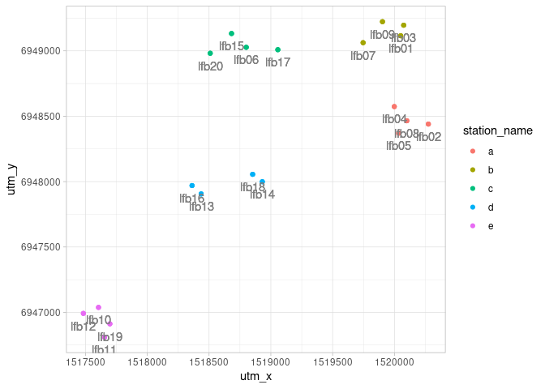
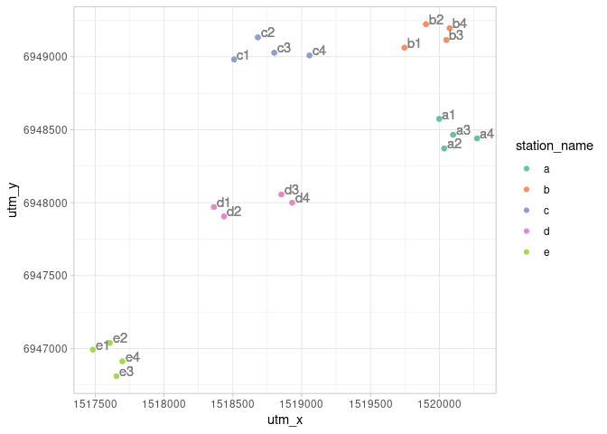
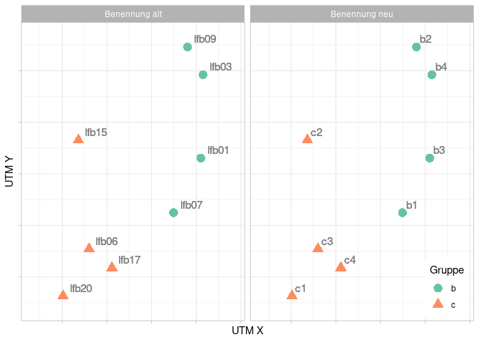

Prepare Data
================
Max Hachemeister
2025-10-01

# 1 import Data

The data from the other bachelor thesis’ were stored in spreadsheets. As
a first step I merged them together and collected some other information
from several sheets, which I did in `libre office`. However I would like
to work as much as possible in R to preserve the raw data, aswell as the
reproducibility of my work.

So here I start from this still pretty raw `.ods` file.

``` r
# here I import the table for deployment from the .ods database and save it as a tibble with the same name
events_records <- read_ods(path = "~/bachelor_thesis/R/work/cameratraps_database_v02_1.ods", 1)

# fields with "NA" are NA, instead of just empty fields
cameras <- read_ods(path = "~/bachelor_thesis/R/work/cameratraps_database_v02_1.ods", 2, na = "NA")

# these have the beginning and end of each deployment, which I need to calculate the active/trapping days of each camera
deployments <- read_ods(path = "~/bachelor_thesis/R/work/cameratraps_database_v02_1.ods", 3)
```

Take a look.

``` r
events_records
```

    ## # A tibble: 570 × 20
    ##    id_event id_cam id_classifier date   time  duration_m temp_celcius moon_phase
    ##       <dbl>  <dbl>         <dbl> <chr>  <tim>      <dbl>        <dbl> <chr>     
    ##  1        1      1             1 11.04… 11:23          1            8 0.5       
    ##  2        2      1             1 20.04… 06:34          1            3 1         
    ##  3        3      1             1 21.04… 16:49         20           24 0.75      
    ##  4        4      3             1 07.04… 20:12          1           14 0.25      
    ##  5        5      3             1 09.04… 18:52          1            9 0.25      
    ##  6        6      3             1 16.04… 07:18          1           -2 0.75      
    ##  7        7      3             1 16.04… 09:16          5            4 0.75      
    ##  8        8      3             1 20.04… 06:13          2            0 1         
    ##  9        9      3             1 25.04… 06:45          5           11 0.5       
    ## 10       10      3             1 25.04… 18:43          5           24 0.5       
    ## # ℹ 560 more rows
    ## # ℹ 12 more variables: activity <chr>, n_rwi <dbl>, resight <chr>,
    ## #   n_alltier <dbl>, n_schmaltier <dbl>, n_kalb <dbl>, ak1 <dbl>,
    ## #   `ak2-3` <dbl>, ak4 <dbl>, note <chr>, day_period_class_old <chr>,
    ## #   pressure_inHg <dbl>

``` r
cameras
```

    ## # A tibble: 60 × 17
    ##    id_cam camera_name station_name id_deployment error1_start error1_end
    ##     <dbl> <chr>       <chr>                <dbl> <chr>        <chr>     
    ##  1      1 lfb01       b                        1 ""           ""        
    ##  2      2 lfb02       a                        1 "03.04.19"   "09.05.19"
    ##  3      3 lfb03       b                        1 ""           ""        
    ##  4      4 lfb04       a                        1 ""           ""        
    ##  5      5 lfb05       a                        1 ""           ""        
    ##  6      6 lfb06       c                        1 ""           ""        
    ##  7      7 lfb07       b                        1 ""           ""        
    ##  8      8 lfb08       a                        1 ""           ""        
    ##  9      9 lfb09       b                        1 ""           ""        
    ## 10     10 lfb10       e                        1 "09.04.19"   "09.05.19"
    ## # ℹ 50 more rows
    ## # ℹ 11 more variables: error2_start <lgl>, error2_end <lgl>, utm_x <dbl>,
    ## #   utm_y <dbl>, make <chr>, model <chr>, note <chr>,
    ## #   daylight_saving_time <dbl>, `am=am` <dbl>, shot_mode <chr>, delay_s <chr>

``` r
deployments
```

    ## # A tibble: 3 × 13
    ##   id_deployment deploy_start deploy_end id_operator n_dawn n_day n_dusk n_night
    ##           <dbl> <chr>        <chr>            <dbl>  <dbl> <dbl>  <dbl>   <dbl>
    ## 1             1 03.04.19     09.05.19             1     35    66     24      15
    ## 2             2 19.07.19     23.10.19             2    128   203    146     184
    ## 3             3 25.11.19     25.02.20             3     43    89    110      97
    ## # ℹ 5 more variables: n_individual <dbl>, n_event <dbl>, n_km2_01 <dbl>,
    ## #   n_km2_02 <dbl>, note <chr>

# 2 tidy data

## 2.1 tidy dates with the `lubridate`-package

``` r
events_records <- events_records |>
  mutate(date = dmy(date))

cameras <- cameras |>
  mutate(
    error1_start = dmy(error1_start),
    error1_end = dmy(error1_end),
    error2_start = dmy(error2_start),
    error2_end = dmy(error2_end)
  )

deployments <- deployments |>
  mutate(deploy_start = dmy(deploy_start),
         deploy_end = dmy(deploy_end))
```

## 2.2 solve entry error

dir `lfb6` exists two times, because of an entry error on my end, while
moving the original data into the `.ods`-spreadsheet.

``` r
# show all entries that have the camera_name "lfb06"
cameras |> 
  filter(camera_name == "lfb06")
```

    ## # A tibble: 3 × 17
    ##   id_cam camera_name station_name id_deployment error1_start error1_end
    ##    <dbl> <chr>       <chr>                <dbl> <date>       <date>    
    ## 1      6 lfb06       c                        1 NA           NA        
    ## 2     26 lfb06       b                        2 NA           NA        
    ## 3     46 lfb06       c                        3 NA           NA        
    ## # ℹ 11 more variables: error2_start <date>, error2_end <date>, utm_x <dbl>,
    ## #   utm_y <dbl>, make <chr>, model <chr>, note <chr>,
    ## #   daylight_saving_time <dbl>, `am=am` <dbl>, shot_mode <chr>, delay_s <chr>

``` r
# can fix that with `if_else`
cameras <- cameras |> 
  mutate(station_name = if_else(camera_name == "lfb06", "c", station_name))

cameras |> 
  filter(camera_name == "lfb06")
```

    ## # A tibble: 3 × 17
    ##   id_cam camera_name station_name id_deployment error1_start error1_end
    ##    <dbl> <chr>       <chr>                <dbl> <date>       <date>    
    ## 1      6 lfb06       c                        1 NA           NA        
    ## 2     26 lfb06       c                        2 NA           NA        
    ## 3     46 lfb06       c                        3 NA           NA        
    ## # ℹ 11 more variables: error2_start <date>, error2_end <date>, utm_x <dbl>,
    ## #   utm_y <dbl>, make <chr>, model <chr>, note <chr>,
    ## #   daylight_saving_time <dbl>, `am=am` <dbl>, shot_mode <chr>, delay_s <chr>

## 2.3 add visual camera names

The camera naming seems off, when viewed on a map. Take a look.

``` r
cameras |>
  ggplot(aes(utm_x, utm_y,  color = station_name, label = camera_name)) +
  geom_point() +
  geom_text(vjust = 1.9, hjust = .5, color = "grey50")
```

<!-- -->

So I’m going to rename them with ascending numbers per group, from left
to right. Fo that I’ll create a `tibble`.

``` r
rename_cameras <- tribble(
  ~camera_name, ~new_name,
  "lfb12", "e1",
  "lfb10", "e2",
  "lfb11", "e3",
  "lfb19", "e4",
  "lfb16", "d1",
  "lfb13", "d2",
  "lfb18", "d3",
  "lfb14", "d4",
  "lfb20", "c1",
  "lfb15", "c2",
  "lfb06", "c3",
  "lfb17", "c4",
  "lfb07", "b1",
  "lfb09", "b2",
  "lfb01", "b3",
  "lfb03", "b4",
  "lfb04", "a1",
  "lfb05", "a2",
  "lfb08", "a3",
  "lfb02", "a4"
)
```

And then join it with the `cameras`, copy the `camera_name` values to a
new column and write the `new_name` values to `camera_name`. Then we can
loose the `new_name` column.

``` r
cameras |> 
  left_join(rename_cameras,
            by = "camera_name") |> 
  mutate(camera_name_old = camera_name,
         camera_name = new_name) |> 
  select(!new_name)
```

    ## # A tibble: 60 × 18
    ##    id_cam camera_name station_name id_deployment error1_start error1_end
    ##     <dbl> <chr>       <chr>                <dbl> <date>       <date>    
    ##  1      1 b3          b                        1 NA           NA        
    ##  2      2 a4          a                        1 2019-04-03   2019-05-09
    ##  3      3 b4          b                        1 NA           NA        
    ##  4      4 a1          a                        1 NA           NA        
    ##  5      5 a2          a                        1 NA           NA        
    ##  6      6 c3          c                        1 NA           NA        
    ##  7      7 b1          b                        1 NA           NA        
    ##  8      8 a3          a                        1 NA           NA        
    ##  9      9 b2          b                        1 NA           NA        
    ## 10     10 e2          e                        1 2019-04-09   2019-05-09
    ## # ℹ 50 more rows
    ## # ℹ 12 more variables: error2_start <date>, error2_end <date>, utm_x <dbl>,
    ## #   utm_y <dbl>, make <chr>, model <chr>, note <chr>,
    ## #   daylight_saving_time <dbl>, `am=am` <dbl>, shot_mode <chr>, delay_s <chr>,
    ## #   camera_name_old <chr>

Let’s redo the map to see the result.

``` r
cameras |> 
  left_join(rename_cameras,
            by = "camera_name") |> 
  mutate(camera_name_old = camera_name,
         camera_name = new_name) |> 
  select(!new_name)|> 
  ggplot(aes(utm_x, utm_y, label = camera_name,  color = station_name)) +
  geom_point() +
  geom_text(vjust = 0, hjust = -0.2, color = "grey50") +
  scale_color_brewer(palette = "Set2")
```

<!-- -->

And safe it to the the object

``` r
cameras <- cameras |> 
  left_join(rename_cameras,
            by = "camera_name") |> 
  mutate(camera_name_old = camera_name,
         camera_name = new_name) |> 
  select(!new_name)
```

### And safe the plots for comparison for the report

``` r
library(ggthemes)

cameras |> 
  filter(station_name == "b" | station_name == "c") |> 
  pivot_longer(cols = c(camera_name_old, camera_name)) |> 
  mutate(name = if_else(name == "camera_name", "Benennung neu", "Benennung alt")) |> 
  ggplot(aes(
    utm_x, 
    utm_y,  
    color = station_name, 
    label = value,
    shape = station_name)
    ) +
  geom_point(size = 4) +
  geom_text(vjust = -0.5, hjust = -.3, color = "grey50", size = 4) +
  scale_color_brewer(palette = "Set2") +
  scale_x_continuous(expand = expansion(mult = .3),
                     labels = NULL)+
  scale_y_continuous(expand = expansion(mult = .1),
                     labels = NULL) +
  facet_wrap(~name) +
  labs(color = "Gruppe",
       shape = "Gruppe",
       x = "UTM X",
       y = "UTM Y") +
  theme(legend.position = "inside",
        legend.position.inside = c(.99, .01),
        legend.justification = c("right", "bottom")
        )
```

<!-- -->

``` r
#ggsave("./export/kameras_neu.png",
#       units = "mm",
#       width = 140,
#       height = 78.75)
```

## 2.3 join `deployment` and `cameras`

I will also rename `am=am` to something more codeable and as
`error2_start` and `error2_end` are empty, I will loose them.

``` r
cameras <- cameras |>
  left_join(select(deployments, 1:3), by = "id_deployment") |>
  rename(am_is_am = `am=am`) |> 
  select(!error2_start:error2_end)
```

## 2.4 check results

``` r
events_records
```

    ## # A tibble: 570 × 20
    ##    id_event id_cam id_classifier date       time   duration_m temp_celcius
    ##       <dbl>  <dbl>         <dbl> <date>     <time>      <dbl>        <dbl>
    ##  1        1      1             1 2019-04-11 11:23           1            8
    ##  2        2      1             1 2019-04-20 06:34           1            3
    ##  3        3      1             1 2019-04-21 16:49          20           24
    ##  4        4      3             1 2019-04-07 20:12           1           14
    ##  5        5      3             1 2019-04-09 18:52           1            9
    ##  6        6      3             1 2019-04-16 07:18           1           -2
    ##  7        7      3             1 2019-04-16 09:16           5            4
    ##  8        8      3             1 2019-04-20 06:13           2            0
    ##  9        9      3             1 2019-04-25 06:45           5           11
    ## 10       10      3             1 2019-04-25 18:43           5           24
    ## # ℹ 560 more rows
    ## # ℹ 13 more variables: moon_phase <chr>, activity <chr>, n_rwi <dbl>,
    ## #   resight <chr>, n_alltier <dbl>, n_schmaltier <dbl>, n_kalb <dbl>,
    ## #   ak1 <dbl>, `ak2-3` <dbl>, ak4 <dbl>, note <chr>,
    ## #   day_period_class_old <chr>, pressure_inHg <dbl>

``` r
cameras
```

    ## # A tibble: 60 × 18
    ##    id_cam camera_name station_name id_deployment error1_start error1_end   utm_x
    ##     <dbl> <chr>       <chr>                <dbl> <date>       <date>       <dbl>
    ##  1      1 b3          b                        1 NA           NA          1.52e6
    ##  2      2 a4          a                        1 2019-04-03   2019-05-09  1.52e6
    ##  3      3 b4          b                        1 NA           NA          1.52e6
    ##  4      4 a1          a                        1 NA           NA          1.52e6
    ##  5      5 a2          a                        1 NA           NA          1.52e6
    ##  6      6 c3          c                        1 NA           NA          1.52e6
    ##  7      7 b1          b                        1 NA           NA          1.52e6
    ##  8      8 a3          a                        1 NA           NA          1.52e6
    ##  9      9 b2          b                        1 NA           NA          1.52e6
    ## 10     10 e2          e                        1 2019-04-09   2019-05-09  1.52e6
    ## # ℹ 50 more rows
    ## # ℹ 11 more variables: utm_y <dbl>, make <chr>, model <chr>, note <chr>,
    ## #   daylight_saving_time <dbl>, am_is_am <dbl>, shot_mode <chr>, delay_s <chr>,
    ## #   camera_name_old <chr>, deploy_start <date>, deploy_end <date>

``` r
deployments
```

    ## # A tibble: 3 × 13
    ##   id_deployment deploy_start deploy_end id_operator n_dawn n_day n_dusk n_night
    ##           <dbl> <date>       <date>           <dbl>  <dbl> <dbl>  <dbl>   <dbl>
    ## 1             1 2019-04-03   2019-05-09           1     35    66     24      15
    ## 2             2 2019-07-19   2019-10-23           2    128   203    146     184
    ## 3             3 2019-11-25   2020-02-25           3     43    89    110      97
    ## # ℹ 5 more variables: n_individual <dbl>, n_event <dbl>, n_km2_01 <dbl>,
    ## #   n_km2_02 <dbl>, note <chr>

# 3. Next

From here we would go to extract the data for the events from the
metadata of the image files. This is done with the `camtrapR` package.
But this is a whole adventure for itself, so I do this in an extra
notebook and from there we go to the next one, which will be merging it
all together and do some exploratory Data analysis.
